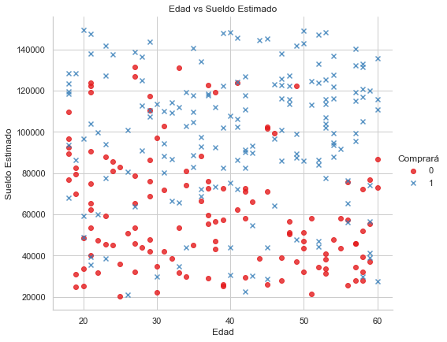
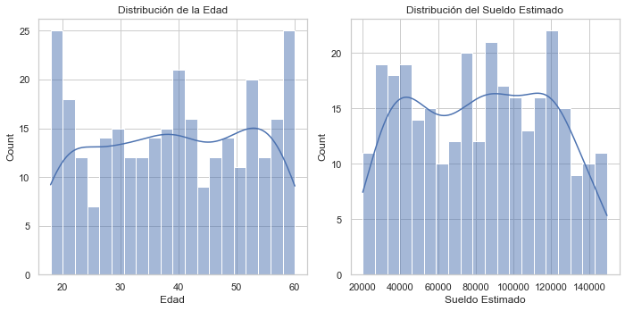
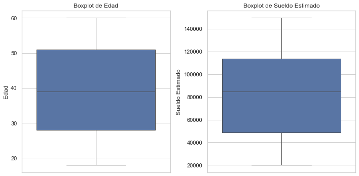
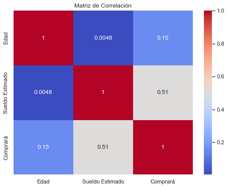
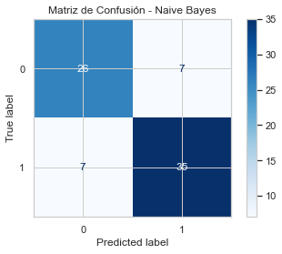
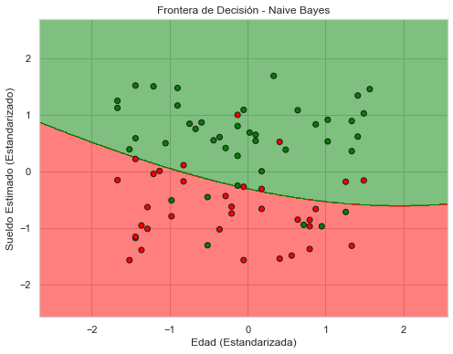
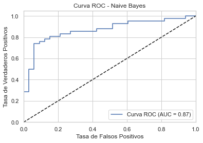

# Proyecto de Clasificación de Compras en Redes Sociales con Naive Bayes

## Tabla de Contenidos

- [Descripción](#descripción)
- [Tecnologías Utilizadas](#tecnologías-utilizadas)
- [Instalación](#instalación)
- [Uso](#uso)
  - [1. Creación del Dataset](#1-creación-del-dataset)
  - [2. Procesamiento y Modelado](#2-procesamiento-y-modelado)
- [Análisis de Resultados](#análisis-de-resultados)
  - [1. Descripción del Dataset](#1-descripción-del-dataset)
  - [2. Evaluación del Modelo](#2-evaluación-del-modelo)
  - [3. Visualizaciones Adicionales](#3-visualizaciones-adicionales)


## Descripción

Este proyecto tiene como objetivo desarrollar un modelo de **Clasificación Naive Bayes** para predecir si un usuario de una red social realizará una compra basándose en su **edad** y **sueldo estimado**. Utilizando un dataset simulado, se entrenó y evaluó un modelo Naive Bayes, analizando su rendimiento mediante diversas métricas de clasificación y visualizaciones. Este enfoque permite comprender cómo las características demográficas influyen en las decisiones de compra, ofreciendo insights valiosos para estrategias de marketing y ventas.

## Tecnologías Utilizadas

- **Lenguajes de Programación:**
  - Python 3.12
- **Entornos de Desarrollo:**
  - Spyder 5
- **Librerías de Python:**
  - `numpy`
  - `pandas`
  - `matplotlib`
  - `seaborn`
  - `scikit-learn`

## Instalación

1. **Clonar el Repositorio:**

   ```bash
   git clone https://github.com/moises60/Naive_Bayes_machine_learning.git
   ```
### Uso 
### Creación del Dataset 
 generar_dataset.py: Genera un dataset con 300 muestras que incluye las columnas Edad, Sueldo Estimado y Comprará. 
 La variable objetivo Comprará se genera en base a una probabilidad que aumenta con el sueldo y ligeramente con la edad

### Procesamiento y Modelado
  clasificador_naive_bayes.py: Este script realiza las siguientes tareas:
  - Carga el dataset generado.
  - Realiza un análisis exploratorio de datos (EDA) con visualizaciones.
  - Divide el dataset en conjuntos de entrenamiento y prueba.
  - Escala las características para mejorar el rendimiento del modelo.
  - Entrena un modelo Naive Bayes.
  - Evalúa el rendimiento del modelo utilizando métricas como la matriz de confusión, precisión, recall, F1-score y la curva ROC.
  - Genera visualizaciones de la frontera de decisión del modelo.

## Análisis de Resultado

## 1. Descripción del Dataset





El dataset consta de 300 muestras con las siguientes características:

# Edad:
- Rango: 18 a 60 años.
- Promedio: ~39 años.
- Desviación estándar: ~12.9 años.
# Sueldo Estimado:
- Rango: $20,093 a $149,492.
- Promedio: ~$82,661.
- Desviación estándar: ~$35,937.
# Comprará:
- Distribución balanceada con 170 instancias de 1 (Compra) y 130 instancias de 0 (No Compra).

## 2. Evaluación del Modelo


Verdaderos Negativos (TN): 26
Falsos Positivos (FP): 7
Falsos Negativos (FN): 7
Verdaderos Positivos (TP): 35


  precision    recall  f1-score   support

           0       0.79      0.79      0.79        33
           1       0.83      0.83      0.83        42

    accuracy                           0.81        75


## 3. Área de Decisión del Modelo en el Conjunto de Prueba



 


El modelo Naive Bayes desarrollado en este proyecto ha demostrado un rendimiento sólido con una precisión global del 81.33%, 
logrando un equilibrio adecuado entre precision y recall para ambas clases. La curva ROC con un AUC de 0.89 respalda la eficacia del
 modelo para distinguir entre usuarios que realizarán una compra y los que no.
